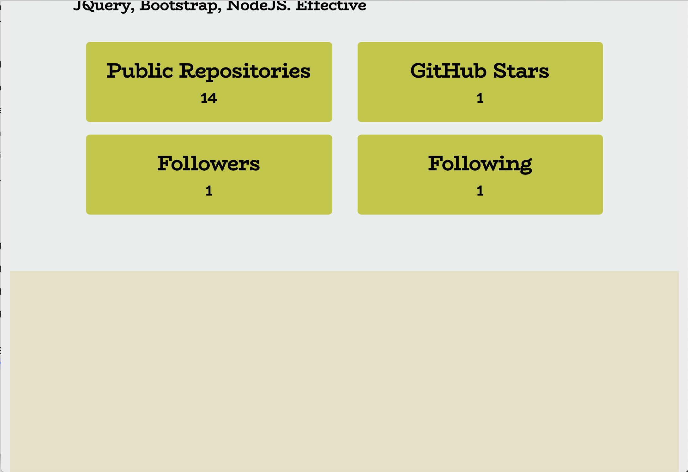

# developer-profile-generator
Developer Profile Generator

## Description:

This is a command-line application that will allow for quick and easy generation of profiles in PDF format.

## Details:

1.   The user will be prompted for a favorite color: which will be used as the background color for cards.

2.    GitHub username: to fetch the GitHub details and generate a pdf profile.

The PDF will be populated with the following:

- Profile image

- User name

- Links to the following:

- User location via Google Maps

- User GitHub profile

- User blog

- User bio

- Number of public repositories

- Number of followers

- Number of GitHub stars

- Number of users following

## Screenshots:

